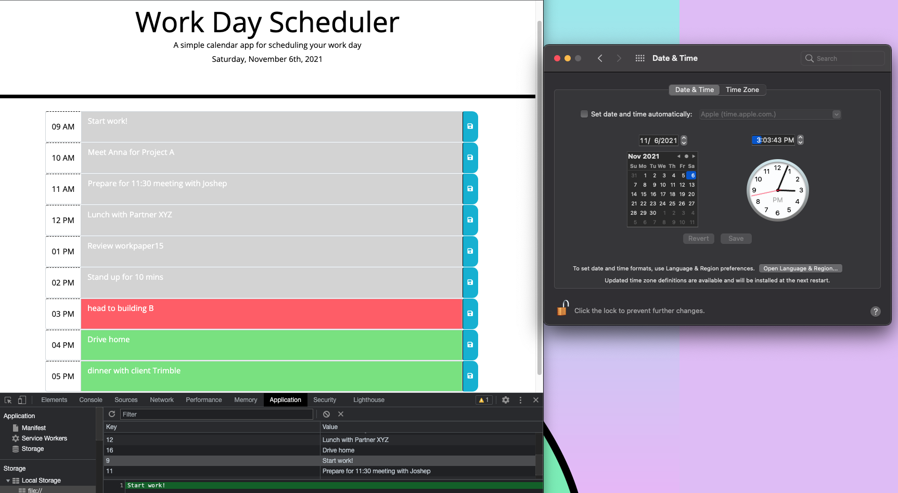
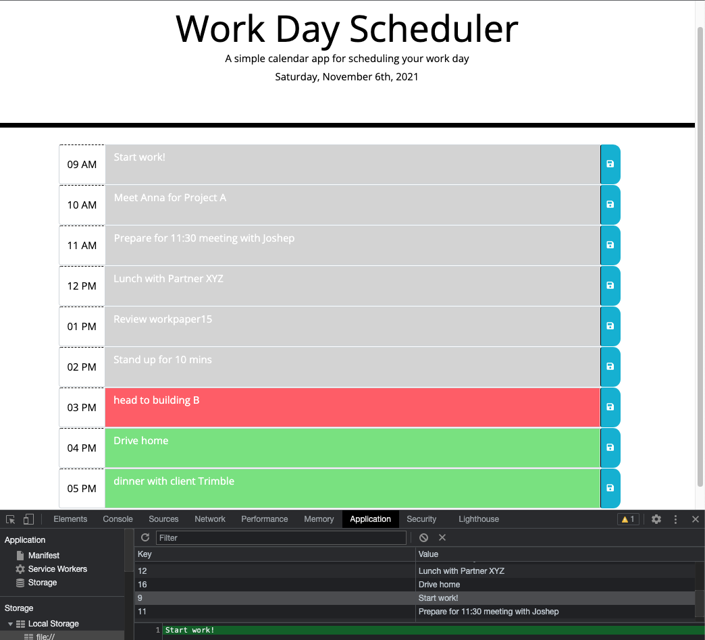

# Work Day Scheduler

## Purpose
* A simple calendar application that allows a user to save events for each hour of the day. Hours are standard working hours from 9AM to 5PM. This app will run in the browser and feature dynamically updated HTML and CSS powered by jQuery.

* The events are saved and retrieved using local storage.

* The time blocks colors change depending on the time of the day. The past time blocks display gray, the current time blocks display red, and the future time blocks display green.

## Built With
* HTML
* CSS
* Javascript
* JQuery
* Bootstrap
* Moment.js

## Website
https://khanhlam90.github.io/work-day-scheduler/

## Contribution
Self-Built and online-research (such as https://stackoverflow.com/ and https://www.w3schools.com/)

## Screenshots demonstrate the web application's appearance and functionality:

### Notes
* Sample screenshots above demonstrate the landing page and its functions. In addition, the time block features show different colors for the past, present, and future time.
* Some events are created for demonstration purpose.
